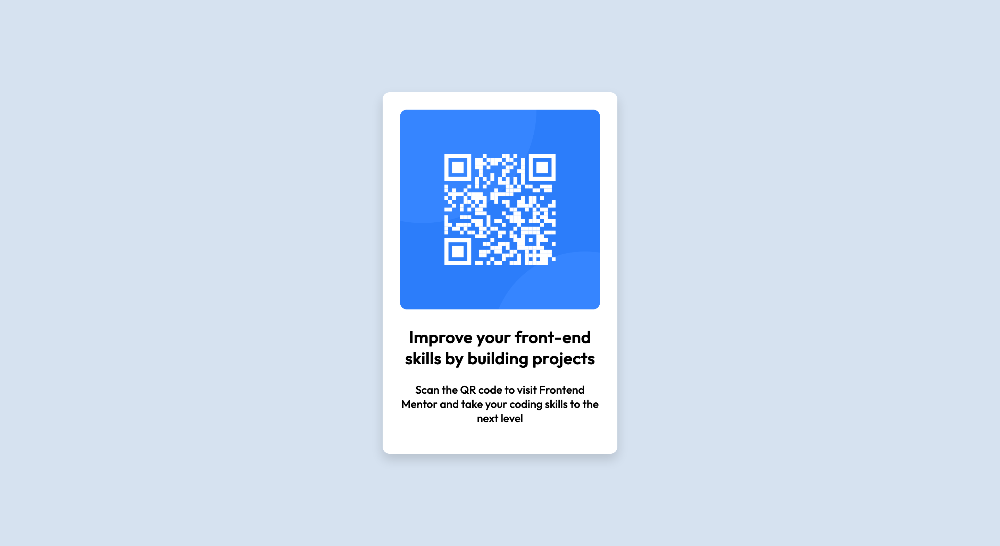

# Frontend Mentor - QR code component solution

This is a solution to the [QR code component challenge on Frontend Mentor](https://www.frontendmentor.io/challenges/qr-code-component-iux_sIO_H). Frontend Mentor challenges help you improve your coding skills by building realistic projects. 

## Table of contents

- [Overview](#overview)
  - [Screenshot](#screenshot)
  - [Links](#links)
- [My process](#my-process)
  - [Built with](#built-with)
  - [What I learned](#what-i-learned)
  - [Continued development](#continued-development)
- [Author](#author)

## Overview

### Screenshot



### Links

- Solution URL: [Add solution URL here](https://github.com/EnigmaTechx/QR-Code-App-Raw.git)
- Live Site URL: [Add live site URL here](https://qr-code-app-raw.vercel.app/)

## My process

### Built with

- Semantic HTML5 markup
- CSS custom properties
- Flexbox

### What I learned

-My first challenge creating a div which would cover the entire screen and serve as a background for the card item. 
The ultimate and most satisfying part of this challenge was applying one of the many 'How To Center a div' solutions. I decided to use flexbox for this because it is simpler and easy for me to remember.

I'm particularly proud of this CSS code snippet that enabled me to place the card item at the center of the page:
```css
.container {
  background-color: hsl(212, 45%, 89%);
  display: flex;
  justify-content: center;
  align-items: center;
  font-family: "Outfit", sans-serif;
  height: 100%;
  width: 100%;
  position: fixed;
  top: 0;
  bottom: 0;
  left: 0;
  right: 0;
}
```

### Continued development

Using raw CSS build deeper understanding and makes it easier to manipulate HTML without using frameworks and templates. I will continue taking on more challenges that involve using CSS to sharpen my knowledge and skills

## Author

- Frontend Mentor - [@EnigmaTechx](https://www.frontendmentor.io/profile/EnigmaTechx)
- Twitter - [@DerryckDX](https://www.twitter.com/DerryckDX)
